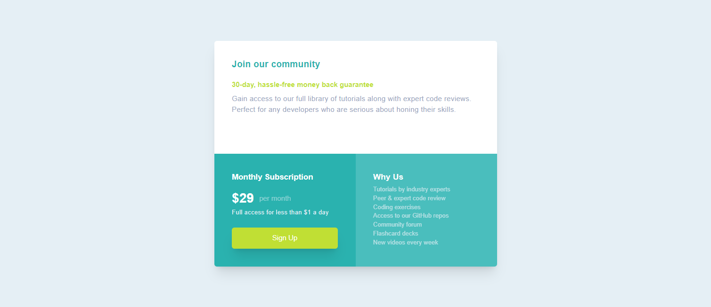

# Frontend Mentor - Single price grid component solution

This is a solution to the [Single price grid component challenge on Frontend Mentor](https://www.frontendmentor.io/challenges/single-price-grid-component-5ce41129d0ff452fec5abbbc).
## Table of contents

- [Overview](#overview)
  - [The challenge](#the-challenge)
  - [Screenshot](#screenshot)
  - [Links](#links)
- [My process](#my-process)
  - [Built with](#built-with)
  - [What I learned](#what-i-learned)
  - [Continued development](#continued-development)
  - [Useful resources](#useful-resources)

## Overview

### The challenge

Users should be able to:

- View the optimal layout for the component depending on their device's screen size
- See a hover state on desktop for the Sign Up call-to-action

### Screenshot

### Links

- Solution URL: [Github](https://github.com/Nipaaaa1/single-price-grid-component)
- Live Site URL: [Netlify](https://stellar-lily-8da44f.netlify.app/)

## My process

### Built with

- Semantic HTML5 markup
- [Tailwind CSS](https://tailwindcss.com/) - CSS Framework

### What I learned

In this challenge I learnt about Using Tailwind CLI instead of CDN. There's some configuration that I need to learn, but overall it's worth it. Smaller CSS, a **TON** of customizations and Tailwind Intellisense that helps me.

Also, I'm using prettier plugin which make the tailwind class sorted automatically. It's a bit nicer this way.

### Continued development

I want to learn more about customizing in Tailwind CSS. Maybe I could someday build a Design System in Tailwind CSS.

### Useful resources

- [Image Color Picker](https://imagecolorpicker.com/) - There's a color that didn't included in the style guide, so I use this to pick that color.
- [HSL to HEX Converter](https://htmlcolors.com/hsl-to-hex) - As always, this helps me convert HSL from style guide to HEX so I could use it in Tailwind CSS.
